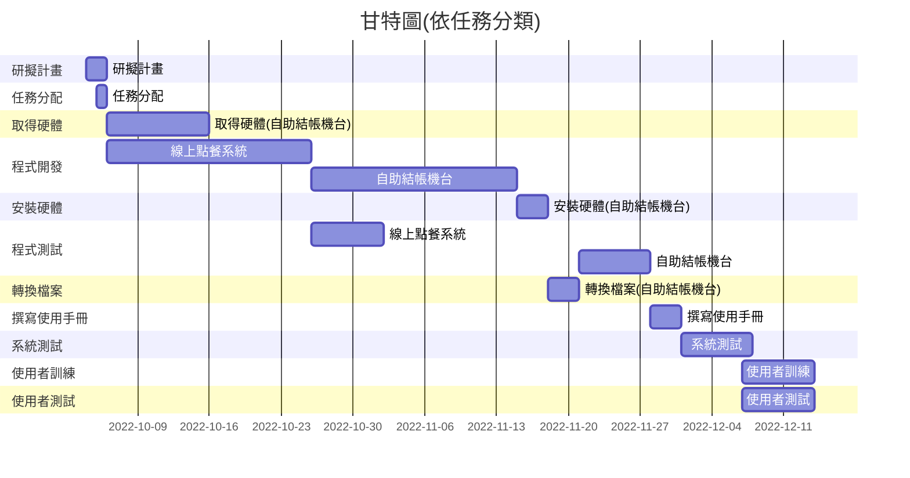
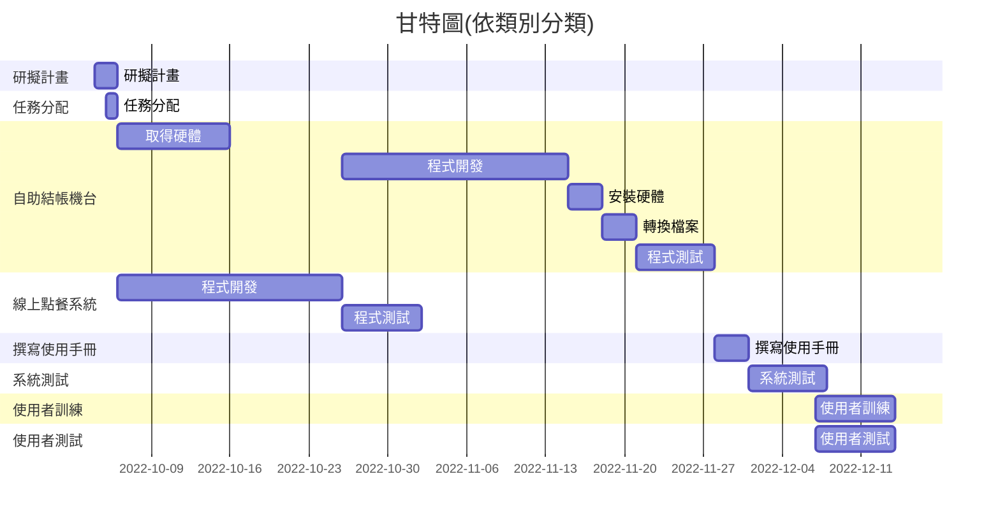

# group12

| 職位 | 學號 | 姓名 | 任務 |
| :---: | :---: | :---: | :---: |
| **組長** | C109118232 | [董秉學](#) |
| 組員 | C109118229 | [蔡雨柔](#) |
| 組員 | C109118257 | [周秉葳](#) |

```mermaid
gantt
    title 甘特圖(依任務分類)
    section 研擬計畫
    研擬計畫:a1, 2022-10-04, 2d
    
    section 任務分配
    任務分配:2022-10-05  , 1d
    
    section 取得硬體
    取得硬體(自助結帳機台):2022-10-06, 10d
    
    section 程式開發
    線上點餐系統:2022-10-6, 20d
    自助結帳機台:2022-10-26, 20d
    
    section 安裝硬體
    安裝硬體(自助結帳機台):2022-11-15, 3d
    
    
    section 程式測試
    線上點餐系統:2022-10-26, 7d
    自助結帳機台:2022-11-21, 7d
    
    section 轉換檔案
    轉換檔案(自助結帳機台):2022-11-18, 3d
    
    section 撰寫使用手冊
    撰寫使用手冊:2022-11-28, 3d
    
    section 系統測試
    系統測試:2022-12-01, 7d
    
    section 使用者訓練
    使用者訓練:2022-12-07, 7d
    
    section 使用者測試
    使用者測試:2022-12-07, 7d
```

```mermaid
gantt
    title 甘特圖(依類別分類)
    section 研擬計畫
    研擬計畫:a1, 2022-10-04, 2d
    
    section 任務分配
    任務分配:2022-10-05  , 1d
    
    section 自助結帳機台
    取得硬體:2022-10-06, 10d
    程式開發:2022-10-26, 20d
    安裝硬體:2022-11-15, 3d
    轉換檔案:2022-11-18, 3d
    程式測試:2022-11-21, 7d
    
    section 線上點餐系統
    程式開發:2022-10-6, 20d
    程式測試:2022-10-26, 7d
      
    section 撰寫使用手冊
    撰寫使用手冊:2022-11-28, 3d
    
    section 系統測試
    系統測試:2022-12-01, 7d
    
    section 使用者訓練
    使用者訓練:2022-12-07, 7d
    
    section 使用者測試
    使用者測試:2022-12-07, 7d
```

