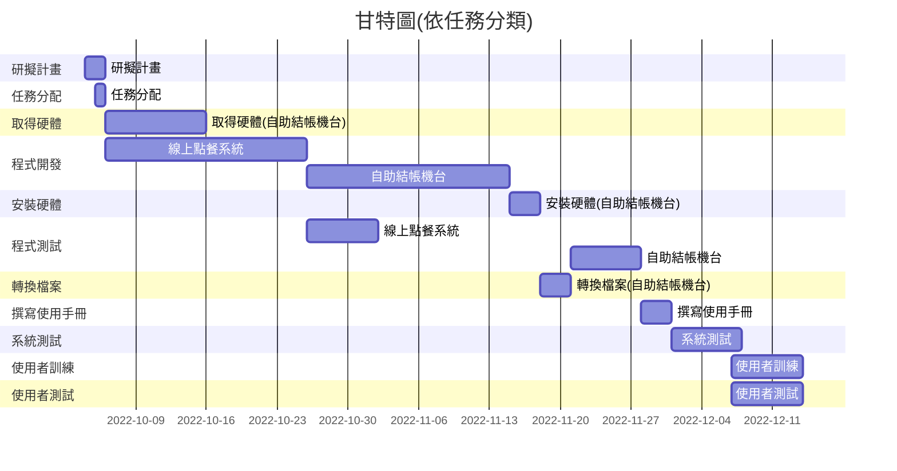
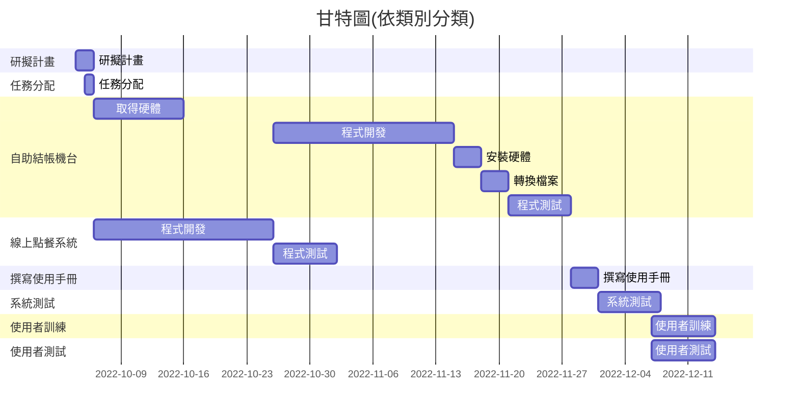

# group12

### 組員名單
| 職位 | 學號 | 姓名 | 任務 |
| :---: | :---: | :---: | :---: |
| **組長** | C109118232 | [董秉學](#) |
| 組員 | C109118229 | [蔡雨柔](#) |
| 組員 | C109118259 | [周秉葳](#) |

___________________________________________________________________________

### 任務清單

| **步驟** | **說明** | **需時天數** | **前置步驟** | **天數總計** |
| :---: | :---: | :---: | :---: | :---: |
| 1 | 研擬計畫 | 2 | - | 2 |
| 2 | 任務分配 | 1 | 1 | 3 |
| 3 | 取得硬體(自助結帳機台) | 10 | 2 | 13 |
| 4 | 程式開發(自助結帳機台) | 20 | 2 | 33 |
| 5 | 程式開發(線上點餐系統) | 20 | 2 | 33 |
| 6 | 安裝硬體(自助結帳機台) | 3 | 3 | 36 |
| 7 | 程式測試(線上點餐系統) | 7 | 5 | 43 |
| 8 | 轉換檔案(自助結帳機台) | 3 | 6 | 46 |
| 9 | 程式測試(自助結帳機台) | 7 | 8 | 53 |
| 10 | 撰寫使用手冊 | 3 | 7、8 | 56|
| 11 | 系統測試 | 7 | 10 | 63 |
| 12 | 使用者訓練 | 7 | 11、12 | 70 |
| 13 | 使用者測試 | 7 | 11、12 | 70 |
| 所需總天數 | | | | 70 |
| 剩餘天數 | | | | 7 |

___________________________________________________________________________

### 甘特圖

